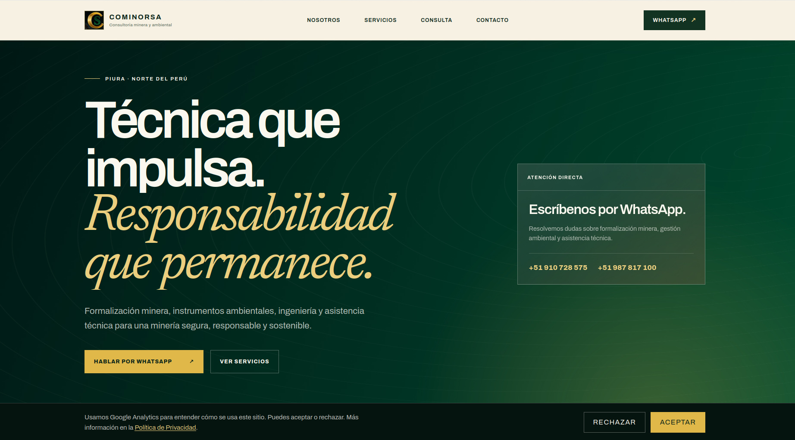

<div align="center">

# COMINORSA — Web

Landing page institucional de **COMINORSA S.A.C.**, consultoría minera y ambiental desde Piura, Perú.

[](LICENSE)
[]()

</div>

---

## Demo



## Índice

- [Demo](#demo)
- [Descripción](#descripción)
- [Características](#características)
- [Stack técnico](#stack-técnico)
- [Instalación](#instalación)
- [Uso](#uso)
- [Estructura del proyecto](#estructura-del-proyecto)
- [Testing](#testing)
- [Despliegue](#despliegue)
- [Licencia](#licencia)

## Descripción

Sitio institucional de COMINORSA S.A.C., consultoría minera y ambiental. Presenta los servicios de la empresa (formalización minera IGAFOM/REINFO, gestión ambiental, ingeniería y planes de minado, seguridad minera, trámites MINEM/INGEMMET/DREM) y canaliza las consultas de contacto directo a WhatsApp, con reenvío opcional del lead a un CRM interno (Twenty CRM).

## Características

- Landing multi-sección con páginas de servicio dedicadas (`igafom-reinfo`, `gestion-ambiental-minera`, `ingenieria-y-planes-de-minado`, `seguridad-minera`, `tramites-minem-ingemmet-drem`, `declaraciones-dac-estamin`, `preguntas-frecuentes`).
- Formulario de consulta que arma un mensaje prellenado y abre WhatsApp (`wa.me/...`), sin depender de que ningún backend responda.
- Reenvío opcional y no bloqueante del lead a Twenty CRM vía `/api/crm-lead`, activo solo si `TWENTY_API_KEY`/`TWENTY_API_URL` están configuradas.
- Accesibilidad: HTML semántico en español, `lang` declarado, skip-link, landmarks, jerarquía de headings monotónica.
- SEO: Open Graph y Twitter Card completos, `robots.ts`, `sitemap.ts`, `manifest.ts`, `og.png` preloadeado.
- Aviso de cookies y páginas legales (`privacidad`, `terminos`).
- Headers de seguridad (CSP, HSTS, X-Frame-Options, Permissions-Policy) generados en build time en `dist-static/_headers`, aplicados por Cloudflare Workers Static Assets.
- Suite de tests propia (a11y, performance, seguridad de output, SEO, integridad del build) con `node --test` y `bun test`, sin dependencias externas de testing.

## Stack técnico

| Capa | Tecnología |
|------|-----------|
| Frontend | Sitio estático — HTML generado en build time por un JSX-runtime propio (`src/html/`), cero React, cero framework |
| Interactividad | 4 módulos ES vanilla (`src/client/`), progressive enhancement, sin bundler runtime |
| Backend | 2 route handlers library-free (`app/api/crm-lead`, `app/api/next-business-day`), servidos por `src/worker/index.ts` |
| Base de datos | Ninguna — los leads van a Twenty CRM vía `/api/crm-lead` |
| Infraestructura | Cloudflare Workers (Static Assets + Worker), deploy con Wrangler |
| Build/dev/test runtime | [Bun](https://bun.sh) (`Bun.build`, `bun test`) — nunca corre en producción (Cloudflare Workers corre `workerd`, no Bun) |
| Package manager | pnpm (lockfile, `allowBuilds` allowlist, pre-commit hook, CI) |
| Estilos | CSS plano hecho a mano (`app/globals.css`), sin Tailwind ni preprocesador |
| Testing | `node --test` (QA/integración) + `bun test` (unidades de `src/`) + Playwright (`pnpm test:e2e`, determinístico vía `webServer`) |

## Instalación

Requisitos: **Node.js >= 22.18.0**, **pnpm >= 11.0.0**, y **Bun** (build/dev/test runtime — `curl -fsSL https://bun.sh/install | bash`).

```bash
git clone git@github.com:Dreamcoder08/cominorsa-web.git
cd cominorsa-web
pnpm install --frozen-lockfile
```

### Variables de entorno

```bash
cp .env.example .env
```

Variables relevantes documentadas en el proyecto (ver `.env.example` y `DEPLOY.md` para el detalle completo):

- `TWENTY_API_KEY` / `TWENTY_API_URL` — opcionales; si faltan, `/api/crm-lead` responde `200 {"ok":true}` sin hacer nada (no-op silencioso).
- Variables de Cloudflare (`CLOUDFLARE_API_TOKEN`, dominio, etc.) — ver [DEPLOY.md](./DEPLOY.md), sección "Variables de entorno y secrets".

## Uso

```bash
pnpm dev
# builds dist-static/ once, then serves it with `wrangler dev`
# (no live rebuild on save — re-run `pnpm dev` after editing source,
# or run `bun --watch src/build/build.ts` in one terminal and
# `wrangler dev` in another: Wrangler's asset dev server reloads the
# browser automatically once dist-static/ changes)

pnpm build     # bun run src/build/build.ts -> dist-static/
pnpm start     # build + wrangler dev (same as `pnpm dev`)
```

## Estructura del proyecto

```
cominorsa-web/
├── src/
│   ├── html/                # jsx-runtime propio (JSX -> HTML strings, sin React)
│   ├── build/                # pipeline de build: páginas, css.ts, js.ts, routes.ts, security-policy.ts...
│   ├── client/               # 4 widgets vanilla (progressive enhancement)
│   ├── data/                 # catálogo de servicios, FAQ (compartido)
│   └── worker/                # Worker de producción (Static Assets + /api/*)
├── app/
│   ├── constants.ts          # WhatsApp numbers, GA env var, etc.
│   ├── globals.css           # CSS plano hecho a mano (tokens en :root)
│   └── api/                  # crm-lead, next-business-day (route handlers library-free)
├── public/                   # og.png, logo.png, favicons, fonts/
├── docker/twenty/             # Stack local/producción de Twenty CRM
├── tests/
│   ├── rendered-html.test.mjs
│   ├── qa/                    # a11y, performance, security, SEO, build (node --test)
│   └── e2e/                   # Playwright, deterministic webServer
├── scripts/                   # Automatización de Cloudflare y Twenty CRM
├── wrangler.jsonc              # config canónico del Worker (Static Assets + /api/*)
├── DEPLOY.md                   # Guía de despliegue a Cloudflare Workers
└── package.json
```

## Testing

```bash
pnpm test                    # build + suite QA completa (node --test)
bun test src/                # unidades de src/ (bun test)
node --test tests/rendered-html.test.mjs   # sólo render
node --test tests/qa/                      # sólo QA suite
pnpm test:e2e                              # Playwright, determinístico (build propio + wrangler dev)
```

## E2E

`pnpm test:e2e` (alias de `e2e:static`) es determinístico y autocontenido:
Playwright's `webServer` (ver `playwright.config.ts`) buildea el sitio con
un `NEXT_PUBLIC_GA_MEASUREMENT_ID` de prueba fijo y lo sirve vía el `wrangler
dev` real — no depende de ningún servidor iniciado a mano ni de lo que haya
en `.env`. Todos los specs importan `test`/`expect` desde
`tests/e2e/guarded-test.ts`, que bloquea service workers y tráfico externo,
intercepta `POST /api/crm-lead`, responde con un resultado sintético y
expone los payloads capturados para las aserciones.

```bash
pnpm test:e2e
# Regresión de aislamiento:
pnpm exec playwright test tests/e2e/provider-isolation.spec.ts --project=chromium
```

## Límite y abuso del endpoint CRM

El límite de 16 KiB se aplica mientras se consume el stream; no depende de `Content-Length`. Es deliberadamente mucho menor que el límite de cuerpo de 100 MB de Workers Free/Pro, porque ese límite de plataforma no es un límite seguro para una aplicación con 128 MB de memoria ([límites de Workers](https://developers.cloudflare.com/workers/platform/limits/)).

La validación evita payloads inválidos y consumo de memoria sin límite, pero **no evita spam con payloads válidos**. La mitigación corresponde al despliegue (por ejemplo, una regla de rate limiting/WAF de Cloudflare y observabilidad), no a estado distribuido inventado dentro del Worker.

## Despliegue

Ver [DEPLOY.md](./DEPLOY.md) para la guía paso a paso de despliegue a Cloudflare Workers, bindings de D1/R2 y configuración de dominio custom.

## Licencia

Software propietario. © COMINORSA S.A.C. — RUC 20614147131. Todos los derechos reservados. Ver [LICENSE](./LICENSE) para los términos completos; el código fuente no puede ser copiado, modificado ni distribuido sin autorización escrita de COMINORSA S.A.C.
